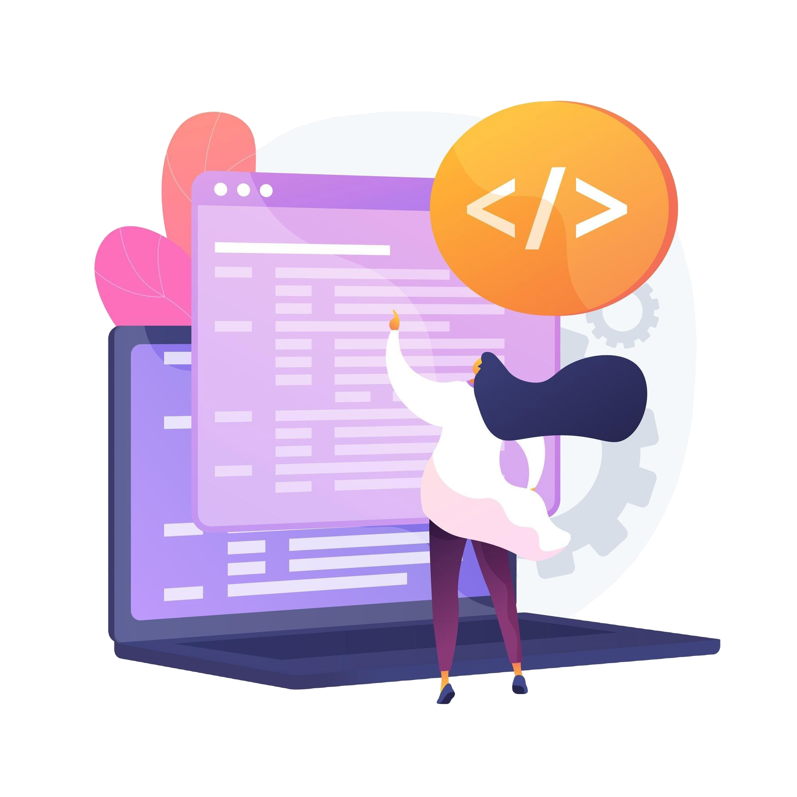

# Hey there, I am Andjelina Kumanova 👋🏻
 
 

## [About me]
- 📚: I am currently studying to become a Full-Stack Developer **(Java and JavaScript)!**
- 💻: I've been passionate about PCs since I was a kid, starting as a gaming enthusiast and evolving into a dedicated coder. My strong foundation in mathematics during school has sharpened my problem-solving skills, which I now apply in my coding.
- 💡: I firmly believe the human potential is endless, so I am always up for new opportunities and challenges!

 
 

## [Tech Stack]
     

